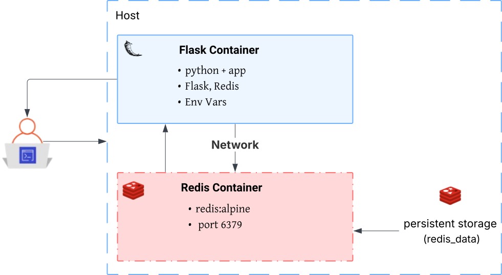

# Multi-Container Flask + Redis Project

## Overview

This project demonstrates a simple web application using Flask and Redis, each running in its own Docker container.

- **Flask** serves a basic site with two routes: `/` and `/count`.
- **Redis** stores a visit counter, incremented whenever `/count` is accessed.
- **Docker Compose** orchestrates both containers.

The goal is to practice containerizing an application and a database, connecting them, and preparing for future scaling or extension.

## Architecture



### Flask Container

- Runs Python and the app (`app.py`).
- Connects to Redis using environment variables.
- Listens on `0.0.0.0:5000` for host accessibility.

### Redis Container

- Uses the official lightweight `redis:alpine` image.
- Exposes port `6379`.
- Optionally backed by a volume for data persistence.

### Networking

- Both containers share an internal Docker network.
- Flask connects to Redis via the service name `redis`.

### Optional Volume

- Mounts into the Redis container to persist data across restarts.

## Application Flow

1. User opens `http://localhost:5000` — Flask responds with a welcome message.
2. User opens `http://localhost:5000/count` — Flask increments and reads the counter from Redis.
3. If Redis is unavailable, the app handles it gracefully.

## Docker Setup

### Dockerfile (Flask)

- Based on `python:3.12-slim`.
- Installs dependencies from `requirements.txt`.
- Runs the Flask app with `flask run --host=0.0.0.0`.

### docker-compose.yml

- Defines two services: `web` (Flask) and `redis`.
- Flask uses environment variables to connect to Redis.
- Redis runs from the official `redis:alpine` image.
- Flask depends on Redis for correct startup order.

## Common Commands

**Build everything:**
```sh
docker compose build
```

**Start services:**
```sh
docker compose up
```

**Stop services:**
```sh
docker compose down
```

## Notes

- Redis is not exposed to the outside world; only Flask communicates with it.
- The `ports` section in `docker-compose.yml` maps container ports to host ports (e.g., `5000:5000` for Flask).
- Scaling is possible: run multiple Flask containers behind a load balancer, sharing a single Redis instance for state.
